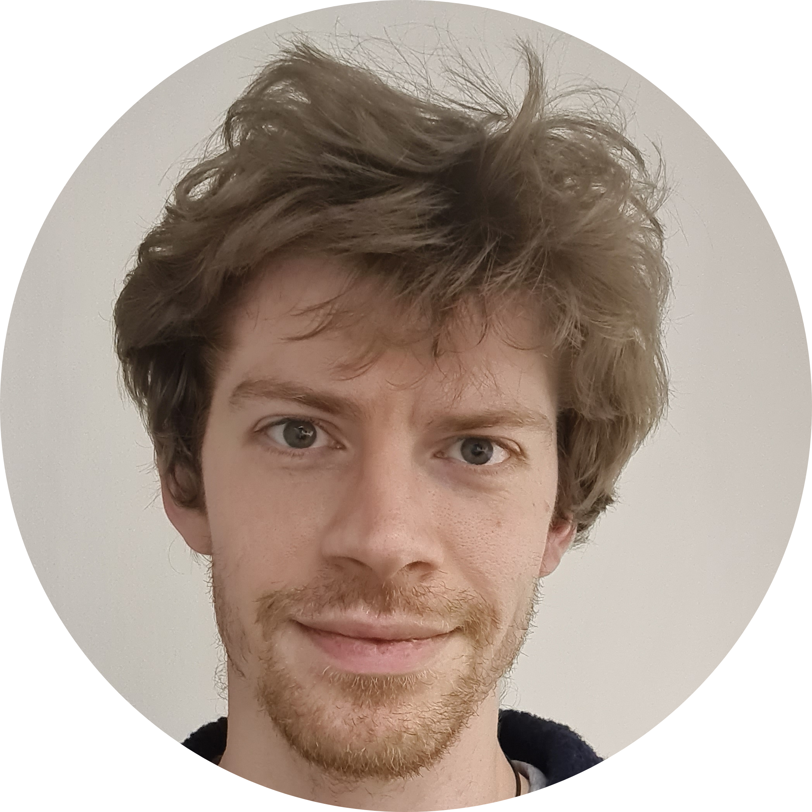
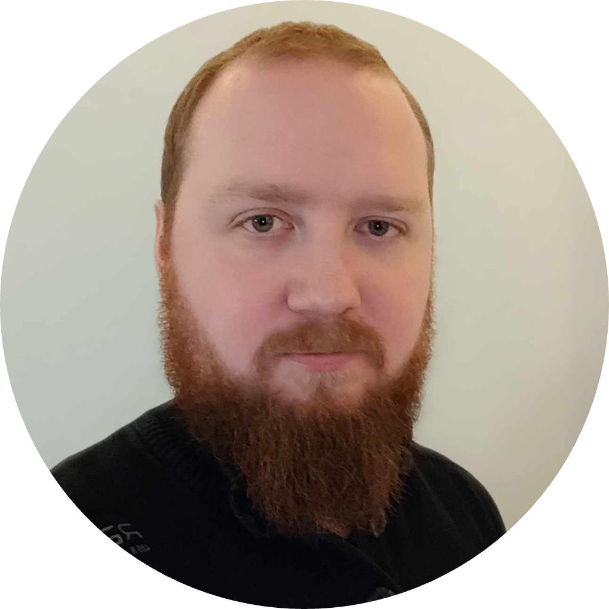
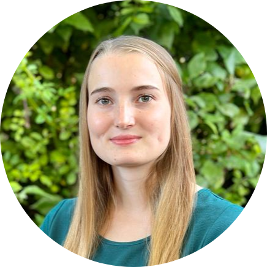
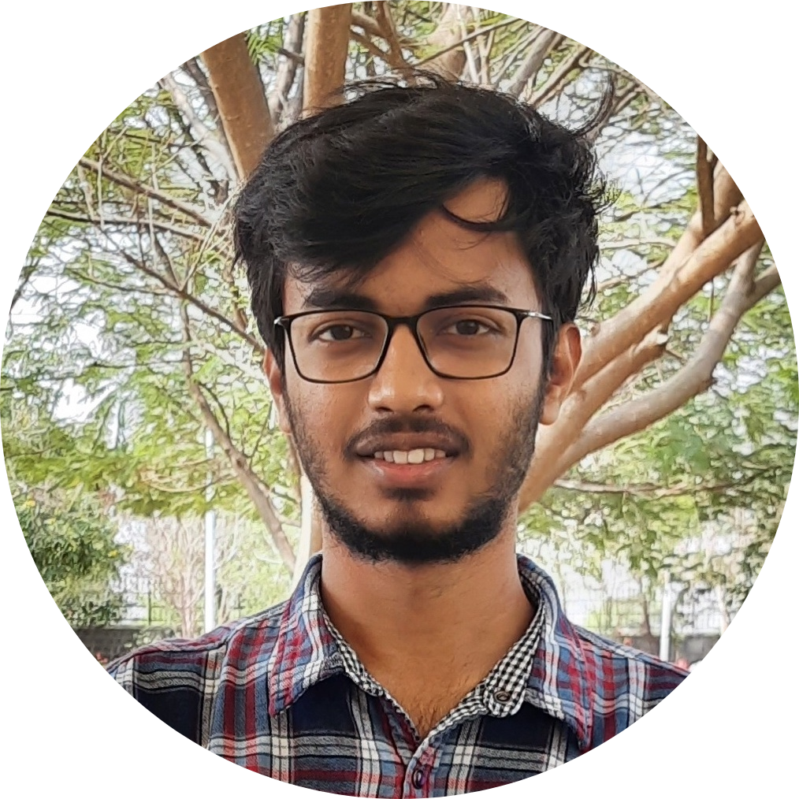
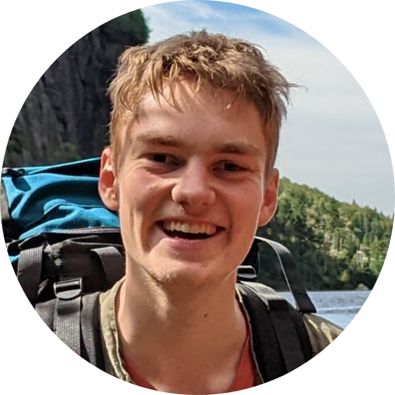

  

## Principal Investigator

<!-- Paul Bürkner -->

::: {.grid}
::: {.g-col-12 .g-col-md-3}
  
{width=100% fig-alt="A portrait of Paul Bürkner."}
:::
::: {.g-col-12 .g-col-md-9}
Paul Bürkner {#paul-buerkner}
---

Background: Statistics, Mathematics, and Psychology

Position: Full Professor of Computational Statistics

[Email](mailto:paul.buerkner@gmail.com){.btn .btn-outline-primary .btn role="button" .btn-page-header .btn-xs}
[University Website](https://compstat.statistik.tu-dortmund.de/en/){.btn .btn-outline-primary .btn role="button" .btn-page-header .btn-xs}
[GitHub](https://github.com/paul-buerkner){.btn .btn-outline-primary .btn role="button" .btn-page-header .btn-xs}
[Google Scholar](https://scholar.google.com/citations?user=JSj6m1IAAAAJ&hl){.btn .btn-outline-primary .btn role="button" .btn-page-header .btn-xs}
[Bluesky](https://bsky.app/profile/paulbuerkner.com){.btn .btn-outline-primary .btn role="button" .btn-page-header .btn-xs}
:::
:::

---

  
  

## PostDocs

<!-- Daniel Habermann -->

::: {.grid}
::: {.g-col-12 .g-col-md-3}
  
{width=100% fig-alt="A portrait of Daniel Habermann."}
:::
::: {.g-col-12 .g-col-md-9}
Daniel Habermann {#daniel-habermann}
---

Background: Computational Biology

Project: [Amortized Bayesian Inference for Multilevel Models](../projects#amortized-mlms) 

[Email](mailto:daniel.habermann@tu-dortmund.de){.btn .btn-outline-primary .btn role="button" .btn-page-header .btn-xs}
[Personal Website](https://daniel-habermann.de){.btn .btn-outline-primary .btn role="button" .btn-page-header .btn-xs}
[GitHub](https://github.com/daniel-habermann){.btn .btn-outline-primary .btn role="button" .btn-page-header .btn-xs}

:::
:::

---

<!-- Simon Kucharsky -->

::: {.grid}
::: {.g-col-12 .g-col-md-3}
  
{width=100% fig-alt="A portrait of Šimon Kucharský."}
:::
::: {.g-col-12 .g-col-md-9}
Šimon Kucharský {#simon-kucharsky}
---

Background: Computational Psychology

Project: [Applications of Amortized Bayesian Inference ](../projects#abi-applications) 

[Email](mailto:simon.kucharsky@tu-dortmund.de){.btn .btn-outline-primary .btn role="button" .btn-page-header .btn-xs}
[Personal Website](https://kucharssim.github.io){.btn .btn-outline-primary .btn role="button" .btn-page-header .btn-xs}
[GitHub](https://github.com/kucharssim/){.btn .btn-outline-primary .btn role="button" .btn-page-header .btn-xs}

:::
:::

---

  
  

## PhD Students

<!-- Svenja Jedhoff -->

::: {.grid}
::: {.g-col-12 .g-col-md-3}
  
{width=100% fig-alt="A portrait of Svenja Jedhoff."}
:::
::: {.g-col-12 .g-col-md-9}
Svenja Jedhoff {#svenja-jedhoff}
---

Background: Data Science

Project: 
[Real-Time Spatio-Temporal Data Analysis for Monitoring Logistics Networks](../projects#abi-logistics)

Co-Supervisor: [Anne Meyer](https://www.imi.kit.edu/2002_4097.php)

[Email](mailto:svenja.jedhoff@tu-dortmund.de){.btn .btn-outline-primary .btn role="button" .btn-page-header .btn-xs}
:::
:::

---

<!-- Lars Kühmichel -->

::: {.grid}
::: {.g-col-12 .g-col-md-3}
  
{width=100% fig-alt="A portrait of Lars Kühmichel."}
:::
::: {.g-col-12 .g-col-md-9}
Lars Kühmichel {#lars-kuehmichel}
---

Background: Physics and Computer Science

Project: [BayesFlow: Simulation Intelligence with Deep Learning](../projects#bayesflow-sim-intelligence)

Co-Supervisor: [Stefan Radev](https://faculty.rpi.edu/stefan-radev)

[Email](mailto:lars.kuehmichel@tu-dortmund.de){.btn .btn-outline-primary .btn role="button" .btn-page-header .btn-xs}
[GitHub](https://github.com/LarsKue){.btn .btn-outline-primary .btn role="button" .btn-page-header .btn-xs}
:::
:::

---

<!-- Aayush Mishra -->

::: {.grid}
::: {.g-col-12 .g-col-md-3}
  
{width=100% fig-alt="A portrait of Aayush Mishra."}
:::
::: {.g-col-12 .g-col-md-9}
Aayush Mishra {#aayush-mishra}
---

Background: Physics and Data Science

Project: [Semi-Supervised Learning for Robust Amortized Bayesian Inference](../projects#semi-supervised-abi)

[Email](mailto:aayush.mishra@tu-dortmund.de){.btn .btn-outline-primary .btn role="button" .btn-page-header .btn-xs}
[Linkedin](https://www.linkedin.com/in/aayush-mishra-64a4a11b9/){.btn .btn-outline-primary .btn role="button" .btn-page-header .btn-xs}
:::
:::

---

<!-- Hans Olischlaeger -->

::: {.grid}
::: {.g-col-12 .g-col-md-3}
  
{width=100% fig-alt="A portrait of Hans Olischläger."}
:::
::: {.g-col-12 .g-col-md-9}
Hans Olischläger {#hans-olischlaeger}
---

Background: Physics

Project: [Deep Bayes in Biomedicine](../projects#deep-bayes-biomed)

[Email](mailto:hans.olischlaeger@tu-dortmund.de){.btn .btn-outline-primary .btn role="button" .btn-page-header .btn-xs}
[GitHub](https://github.com/han-ol){.btn .btn-outline-primary .btn role="button" .btn-page-header .btn-xs}
[Bluesky](https://bsky.app/profile/han-ol.bsky.social){.btn .btn-outline-primary .btn role="button" .btn-page-header .btn-xs}
:::
:::

---

<!-- Yiming Zang -->

::: {.grid}
::: {.g-col-12 .g-col-md-3}
  
{width=100% fig-alt="A portrait of Yiming Zang."}
:::
::: {.g-col-12 .g-col-md-9}
Yiming Zang {#yiming-zang}
---

Background: Mathematics and Data Science

Project: [Deep Bayes in Biomedicine](../projects#deep-bayes-biomed)

[Email](mailto:yiming.zang@tu-dortmund.de){.btn .btn-outline-primary .btn role="button" .btn-page-header .btn-xs}
:::
:::

---

  
  

::: {.callout-note icon=false collapse="true"}
## Alumni

- Javier Aguilar (2021--2026).
[Website](https://jear2412.github.io){.btn .btn-outline-primary .btn role="button" .btn-page-header .btn-xs}
[Project](../projects#joint-priors-mlms){.btn .btn-outline-primary .btn role="button" .btn-page-header .btn-xs}

- Florence Bockting (2022--2025). 
[Website](https://florence-bockting.github.io){.btn .btn-outline-primary .btn role="button" .btn-page-header .btn-xs}
[Project](../projects#sbpriors){.btn .btn-outline-primary .btn role="button" .btn-page-header .btn-xs}

- Luna Fazio (2022--2025).
[Website](https://lunafazio.github.io){.btn .btn-outline-primary .btn role="button" .btn-page-header .btn-xs}
[Project](../projects#bdlvms){.btn .btn-outline-primary .btn role="button" .btn-page-header .btn-xs}

- Soham Mukherjee (2022--2025).
[Linkedin](https://www.linkedin.com/in/soham-mukherjee-33a397146){.btn .btn-outline-primary .btn role="button" .btn-page-header .btn-xs}
[Project](../projects#scrna-models){.btn .btn-outline-primary .btn role="button" .btn-page-header .btn-xs}

- Philipp Reiser (2022--2025). 
[LinkedIn](https://de.linkedin.com/in/philipp-reiser-a33163165){.btn .btn-outline-primary .btn role="button" .btn-page-header .btn-xs}
[Project](../projects#uncertainty-surrogate-models){.btn .btn-outline-primary .btn role="button" .btn-page-header .btn-xs}

- Marvin Schmitt (2021--2025).
[Website](https://marvin-schmitt.com/){.btn .btn-outline-primary .btn role="button" .btn-page-header .btn-xs}
[Project](../projects#mu-bmc){.btn .btn-outline-primary .btn role="button" .btn-page-header .btn-xs}

- Maximilian Scholz (2021--2024).
[Website](https://www.scholzmx.com/){.btn .btn-outline-primary .btn role="button" .btn-page-header .btn-xs}
[Project](../projects#ml4bmb){.btn .btn-outline-primary .btn role="button" .btn-page-header .btn-xs}

- Stefan Radev (2021--2023).
[Website](https://faculty.rpi.edu/stefan-radev){.btn .btn-outline-primary .btn role="button" .btn-page-header .btn-xs}
[LinkedIn](https://de.linkedin.com/in/stefan-radev-21b713187){.btn .btn-outline-primary .btn role="button" .btn-page-header .btn-xs}
:::
